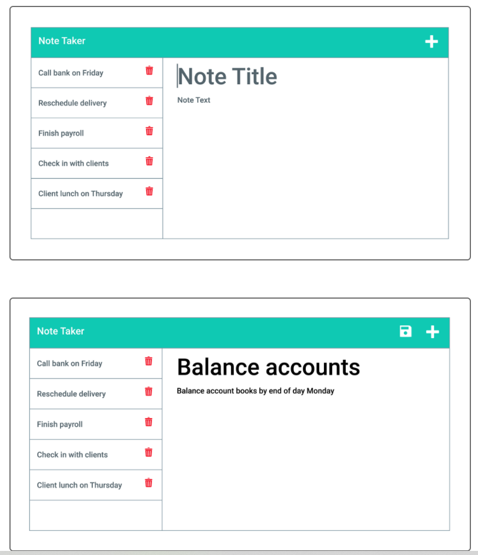

# IDEA_CACHE

## User Story

AS A small business owner
I WANT to be able to write and save notes
SO THAT I can organize my thoughts and keep track of tasks I need to complete

## Acceptance Criteria

- [x] GIVEN a note-taking application
WHEN I open the Note Taker
THEN I am presented with a landing page with a link to a notes page

- [x]WHEN I click on the link to the notes page
THEN I am presented with a page with existing notes listed in the left-hand column, plus empty fields to enter a new note title and the note’s text in the right-hand column

- [x]WHEN I enter a new note title and the note’s text
THEN a Save icon appears in the navigation at the top of the page

- [x] WHEN I click on the Save icon
THEN the new note I have entered is saved and appears in the left-hand column with the other existing notes

- [x] WHEN I click on an existing note in the list in the left-hand column
THEN that note appears in the right-hand column

- [x] WHEN I click on the Write icon in the navigation at the top of the page
THEN I am presented with empty fields to enter a new note title and the note’s text in the right-hand column

Getting Started:

- [x] GET /notes should return notes.html

- [x] GET * should return the index.html

- [x] GET /api/notes should read the db.json file and return all saved notes as JSON

- [x] POST /api/notes should receive a new note to save on the request body, add it to the db.json file, and return the new note to the client.

- [x] Each note will need a unique id when it's saved (look into npm packages that could do this for me).

- [x] BONUS: DELETE requests.   DELETE api/notes/:id should receive a query parameter containing the id of a note to delete.  In order to delete a note, you'll need to read all notes from the db.json file, remove the note with the given id property, then rewrite the notes to the db.json file.

## Grading Requirements

- [x] This Challenge is graded based on the following criteria:

## Technical Acceptance Criteria: 40%
- [x] Satisfies all of the preceding acceptance criteria plus the following:

- [x] Application front end must connect to an Express.js back end.

- [x] Application back end must store notes with unique IDs in a JSON file.

- [ ] Application must be deployed to Heroku.

## Deployment: 36%
- [ ] Application deployed at live URL.

- [ ] Application loads with no errors.

- [ ] Application GitHub URL submitted.

- [ ] GitHub repository contains application code.

## Application Quality: 11%
- [ ] Application console is free of errors.
## Repository Quality: 13%
- [x] Repository has a unique name.

- [x] Repository follows best practices for file structure and naming conventions.

- [x] Repository follows best practices for class/id naming conventions, indentation, quality comments, etc.

- [x] Repository contains multiple descriptive commit messages.

- [ ] Repository contains quality README file with description, screenshot, and link to deployed application.

## Bonus: +10 Points
- [ ] Application allows users to delete notes.
## How to Submit the Challenge
- [ ] You are required to submit BOTH of the following for review:

- [ ] The URL of the functional, deployed application.

- [ ] The URL of the GitHub repository. Give the repository a unique name and include a README describing the project.