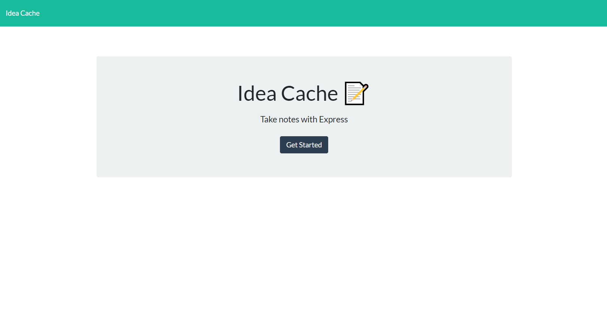
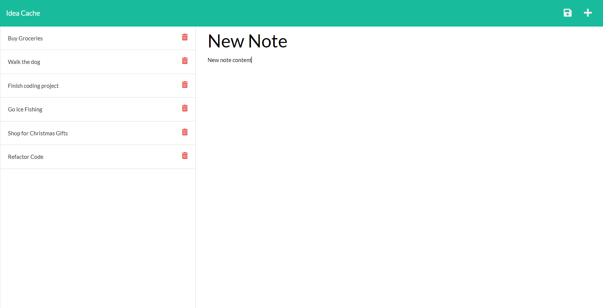

# Idea_Cache
---

  
  
   
   
   
   
   
## Description

Idea Cache allows the user to store their ideas on an express server.  It demonstrates the use of node.js, express server npm, as well as overall good programing practices.

---
  ## Table of Contents

  [Features](#features)

  [Screenshot](#screenshot)

  [Installation](#installation)
    
  [Usage](#usage)
    
  [License](#license)
    
  [Contributing](#contributing)

  [Questions](#questions)
  
  

---

## Features

      1. Uses Express.js 

      2. Uses Node 

      3. Saves files to a remote server 
---

## Screenshot 
  
  
  
  

  ---

  ## Installation

      1. Clone the reposititory 

      2. type: npm init --y 

      3. npm i express 

      4. npm i uuid 
---
  ## Usage

      1. From the prompt type node index.js 

  ---
  ## License 

  &emsp; 

      To read about the license of this project click the link below.

  &emsp;[License](https://github.com/tgtiburon/Idea_Cache/blob/main/LICENSE) 

  ---
  ## Contributing

      1. Either email me, or leave a message on the github repository. 

---
## Questions

If you have any questions about this project feel free to email me at <tg.tiburon@gmail.com>.  

To see the rest of my portfolio, visit [Github](https://github.com/tgtiburon).

Below is a graphic displaying my most used languages on github.

This Readme file was created with Readme Architect by Tony Gendreau &copy;
